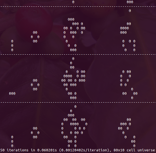
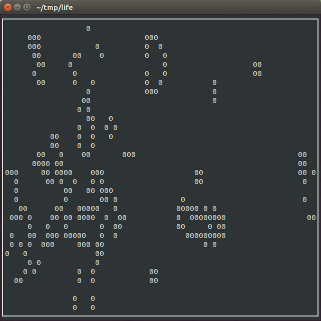
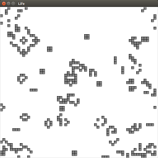

# Life

An optimized version of Conway's Game of Life, developed in Python. It includes
three ways to run the simulation, console print, curses and a GUI via Tk.





## Why?

I decided to write this when considering to apply to [Hacker
School](https://www.hackerschool.com/). Their [application
process](https://www.hackerschool.com/apply) asks for a link to a program you
have written completely from scratch without using frameworks. I had started
this project because I never implemented Conway's game of life and I wanted to
get a little more acquainted with Python. I had fun trying to optimize this for
better computational complexity and trying to support multiple graphical
environments.

## Requirements

To run this program, you will need:

  * A working Python 2 installation

## Running

You have the choice to run the application three different ways:

  * Console print - prints iterations to the console, the simplest
  * Curses - uses the curses library for a more graphical console experience
  * Tk - uses the Tkinter library for python to provide a graphical experience

You run them by executing one of the following commands:

```
# Run the print version
./main_print.py

# Run the curses version
./main_curses.py

# Run the graphical version
./main_tk.py
```

